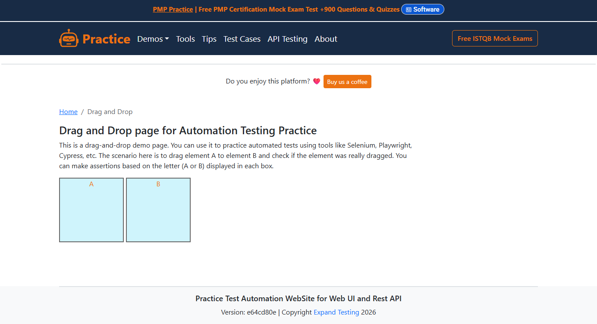
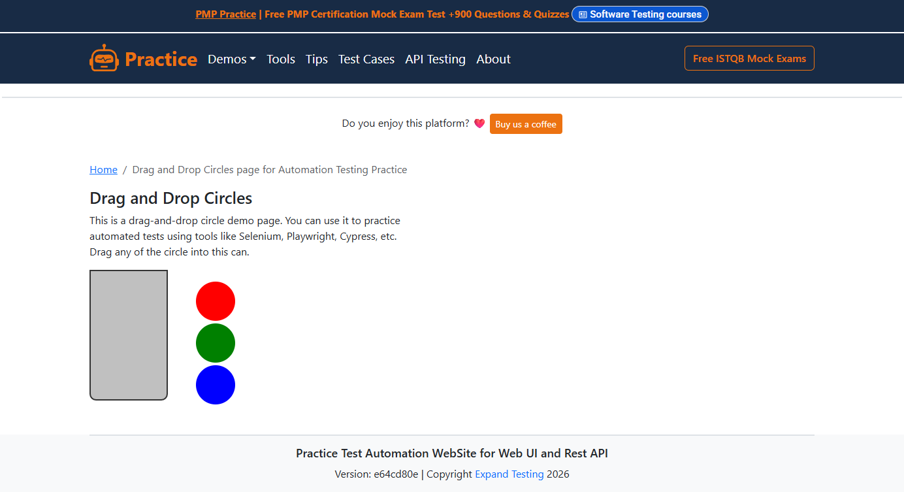

# Drag & Drop

Versucht man, ein HTML5-Element mit `draggable="true"` über Seleniums
ActionChains zu ziehen, passiert — nichts:

```python
ActionChains(driver).drag_and_drop(source, target).perform()
```

Kein Fehler, keine Bewegung. Das ist eine bekannte Selenium-Einschränkung:
ActionChains erzeugt Maus-Events, HTML5 Drag & Drop braucht aber
`DragEvent`-Objekte mit einem `DataTransfer`. Der Browser löst deshalb
nie `dragstart`, `drop` oder `dragend` aus.



## Die OKW-Lösung

Der einfache Fall — A auf B ziehen:

```robot
DragTo Spalte A Nach B
    VerifyValue    SpalteA    A
    VerifyValue    SpalteB    B
    DragTo         SpalteA    SpalteB
    VerifyValue    SpalteA    B
    VerifyValue    SpalteB    A
```

Ein Keyword, Quelle und Ziel. Fertig.

Mehrstufig mit `DragStart` und `Drop`:

```robot
Spalte A Nach B Ziehen
    VerifyValue    SpalteA    A
    VerifyValue    SpalteB    B
    DragStart      SpalteA
    Drop           SpalteB
    VerifyValue    SpalteA    B
    VerifyValue    SpalteB    A
```

Zwischen `DragStart` und `Drop` können beliebig viele `DragOver` stehen —
z. B. um in einem Baum Ordnerknoten aufzuklappen, bevor abgelegt wird.

## Sammeln, dann ausführen

| Keyword | Was es tut | Ausgelöste Events |
|---|---|---|
| `DragStart` | Merkt sich das Quellelement | Keine |
| `DragOver` | Fügt ein Zwischenziel hinzu (wiederholbar) | Keine |
| `Drop` | Löst die gesamte Sequenz **atomar** per JavaScript aus | Alle |
| `DragTo` | Kurzform für `DragStart` + `Drop` ohne Zwischenziele | Alle |

**Warum atomar?** Der Browser erwartet `dragstart` bis `dragend` als eine
zusammenhängende Sequenz. Werden die Events einzeln über getrennte
JavaScript-Aufrufe ausgelöst, kann der `DataTransfer`-Zustand verloren
gehen.

## Unter der Haube

OKW simuliert die vollständige HTML5-Event-Sequenz per `execute_script`:

```
dragstart(Quelle)
  → dragenter(Zwischenziel) → dragover(Zwischenziel) → dragleave(Zwischenziel)
  → dragenter(Ziel) → dragover(Ziel) → drop(Ziel)
→ dragend(Quelle)
```

Es werden echte `DragEvent`-Objekte mit echtem `DataTransfer` erzeugt —
genau das, was der Browser erwartet. Zwei Muster sind getestet:

- **Spalten tauschen** — die Seite tauscht den Inhalt per JS-Event-Handler
- **Kreise verschieben** — die Seite verschiebt DOM-Knoten per `appendChild`



## Die YAML

```yaml
# locators/DragDropPage.yaml (Auszug)
SpalteA:
  class: okw_web_selenium.widgets.webse_label.WebSe_Label
  locator: { id: column-a }

SpalteB:
  class: okw_web_selenium.widgets.webse_label.WebSe_Label
  locator: { id: column-b }
```

Standard-Widgets, keine speziellen Drag-Klassen. Die Drag-Fähigkeit
bringt die Basisklasse für jedes Widget mit.

## Lauffähige Beispiele

| Beispiel | Datei |
|---|---|
| Spalten tauschen | [`selenium/expandtesting/tests/DragDrop.robot`](https://github.com/Hrabovszki1023/okw-examples/blob/master/selenium/expandtesting/tests/DragDrop.robot) |
| Kreise verschieben | [`selenium/expandtesting/tests/DragDropCircles.robot`](https://github.com/Hrabovszki1023/okw-examples/blob/master/selenium/expandtesting/tests/DragDropCircles.robot) |
