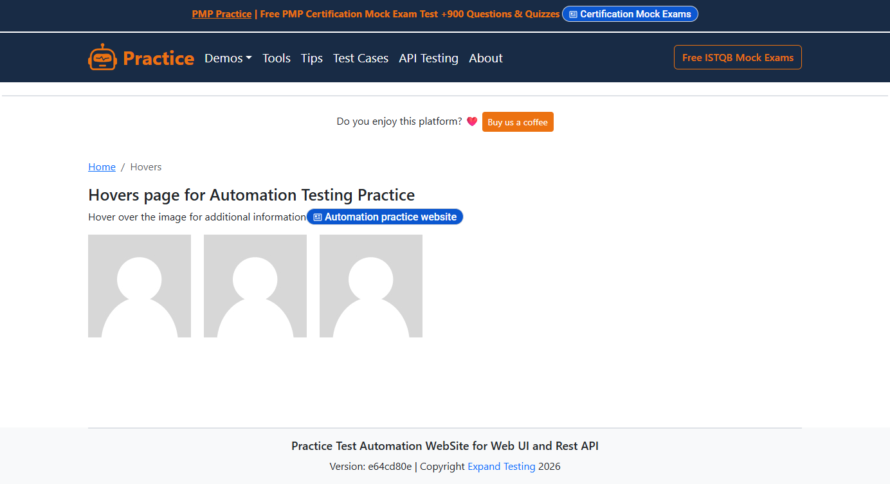

# Hover

Manche Elemente erscheinen erst, wenn die Maus darüberfährt: Tooltips,
Profil-Overlays, Dropdown-Menüs, Aktions-Buttons auf Karten. Selenium
löst das mit ActionChains:

```python
ActionChains(driver).move_to_element(avatar).perform()
```

In einer Testsuite muss aber zuerst das richtige Element feststehen. Gibt
es drei Benutzerkarten, die beim Hover jeweils andere Informationen
zeigen, muss der Test die richtige Karte wählen, hovern und dann den
richtigen Inhalt prüfen.



## Der Test

```robot
MoveOver zeigt User1 Info
    OnFailNOISE    SetContext      UserCard    user1
    MoveOver        Avatar
    VerifyValueWCM  Benutzername    *user1*

MoveOver zeigt User2 Info
    OnFailNOISE    SetContext      UserCard    user2
    MoveOver        Avatar
    VerifyValueWCM  Benutzername    *user2*

MoveOver ProfilLink wird sichtbar
    OnFailNOISE    SetContext      UserCard    user1
    MoveOver        Avatar
    VerifyExists     ProfilLink    YES
```

`SetContext` wählt die Karte. `MoveOver` löst den Hover aus.
`VerifyValueWCM` prüft den eingeblendeten Inhalt. `VerifyExists` bestätigt,
dass der versteckte Link erschienen ist.

Dieselben Keywords, anderer Kontext — drei Benutzerkarten ohne
Code-Duplizierung.

## Die YAML

```yaml
# locators/HoversPage.yaml (Auszug)
UserCard:
  __context__:
    locator: { xpath: '//div[@class="figure"][.//h5[contains(text(),"{UserName}")]]' }
  Avatar:
    class: okw_web_selenium.widgets.webse_label.WebSe_Label
    locator: { xpath: './/img[@alt="User Avatar"]' }
  Benutzername:
    class: okw_web_selenium.widgets.webse_label.WebSe_Label
    locator: { xpath: './/h5' }
  ProfilLink:
    class: okw_web_selenium.widgets.webse_button.WebSe_Button
    locator: { xpath: './/a[text()="View profile"]' }
```

Der `__context__` (siehe [Wiederholende Strukturen](setcontext.md))
grenzt alle Kind-Widgets auf eine Benutzerkarte ein. `MoveOver` bewegt
die Maus auf `Avatar` innerhalb dieser Karte — der CSS-Zustand `:hover`
wird aktiv und die versteckten Elemente werden sichtbar.

## Wann MoveOver verwenden?

| Szenario | Beispiel |
|---|---|
| Tooltip prüfen | `MoveOver Feld` → `VerifyTooltip Feld Hilfetext` |
| Verstecktes Overlay | `MoveOver Avatar` → `VerifyValue Name admin` |
| Menü öffnen | `MoveOver Datei` → `ClickOn Neu` |
| Existenz prüfen | `MoveOver Karte` → `VerifyExists Loeschen YES` |

`MoveOver` nutzt intern ebenfalls ActionChains — aber eingebettet in die
OKW-Synchronisation: Das Element wird erst abgewartet und dann
angefahren. Der Test enthält keine Waits.

## Lauffähiges Beispiel

[`selenium/expandtesting/tests/Hovers.robot`](https://github.com/Hrabovszki1023/okw-examples/blob/master/selenium/expandtesting/tests/Hovers.robot)
