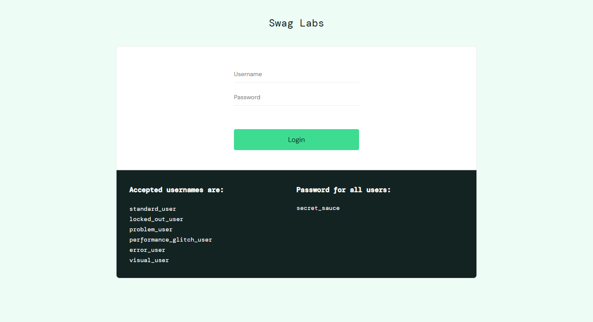

# Web Selenium

The library `robotframework-okw-web-selenium` is the OKW driver for web
applications. It uses Selenium WebDriver via SeleniumLibrary for Robot
Framework.

Most Selenium test suites share the same problem: CSS selectors, XPaths
and driver calls sit directly in the test code. When the UI changes, you
fix locators across dozens of files. With OKW, the test contains only
**Signal** — what is being tested. Locators and driver technology
(**NOISE**) live in YAML and in widget classes.

!!! info "ISO/IEC/IEEE 29119-5"
    OKW implements the keyword architecture of ISO 29119-5:
    **Domain Layer** (`.robot` test) → **Decomposer** (OKW core + YAML)
    → **Test Interface Layer** (widget + Selenium adapter).
    The Page Object Model does not —
    see [Why not POM?](../../grundlagen/warum-kein-pom.md).

## Installation

```bash
pip install robotframework-okw-web-selenium
```

Automatically installs `robotframework-okw4robot` (core) and
`robotframework-seleniumlibrary` as dependencies.

## First Test: SauceDemo Login

This example shows the complete structure of an OKW web test — from the
YAML to a runnable test case. The system under test is the public demo
shop [saucedemo.com](https://www.saucedemo.com).

!!! note "German business names"
    The widget and keyword names in the examples (`Benutzer`, `Passwort`,
    `Anmelden Mit`) are German, because they come unchanged from the
    runnable [okw-examples](https://github.com/Hrabovszki1023/okw-examples)
    repository. Use the business language of your own domain — that is
    exactly the point of business names.



### Step 1: Create the app YAML

The app YAML defines the browser and collects all pages:

```yaml
# locators/MyAppChrome.yaml
MyAppChrome:
  __self__:
    class: okw_web_selenium.adapters.selenium_web.SeleniumWebAdapter
    browser: chrome
  Chrome: !include Chrome.yaml
  _pages: !include-merge Allpages.yaml
```

`__self__` configures the adapter. `!include-merge` brings all page YAMLs
into the app as direct children — not nested.

### Step 2: Define the page YAML

Each page gets its own YAML file with business names:

```yaml
# locators/SauceDemoLogin.yaml
__self__:
  class: okw_web_selenium.widgets.webse_label.WebSe_Label
  locator: { css: '[data-test="login-container"]' }

Benutzer:
  class: okw_web_selenium.widgets.webse_textfield.WebSe_TextField
  locator: { css: '[data-test="username"]' }

Passwort:
  class: okw_web_selenium.widgets.webse_textfield.WebSe_TextField
  locator: { css: '[data-test="password"]' }

Anmelden:
  class: okw_web_selenium.widgets.webse_button.WebSe_Button
  locator: { css: '[data-test="login-button"]' }

Fehlermeldung:
  class: okw_web_selenium.widgets.webse_label.WebSe_Label
  locator: { css: '[data-test="error"]' }
```

The YAML file serves two purposes:

1. **Business names.** The test says `Benutzer` (user) — a business term,
   not a technical ID (`txtUser`, `btnLogin`). The YAML maps it to the
   concrete locator.
2. **Widget behavior.** `class` defines *how* a keyword is executed on
   the GUI object. A `TextField` knows how to `SetValue` (clear + type),
   a `Button` knows how to `ClickOn`.

When a `data-test` attribute changes, you fix it here — **once** — and
all test cases keep working.

### Step 3: Collect pages in Allpages

```yaml
# locators/Allpages.yaml
SauceDemoLogin: !include SauceDemoLogin.yaml
SauceDemoProducts: !include SauceDemoProducts.yaml
```

New pages are added here once — all app YAMLs (Chrome, Firefox, ...)
get them automatically.

### Step 4: Write the test file

```robot
*** Settings ***
Library        okw_web_selenium.library.OkwWebSeleniumLibrary
Test Setup     Login Seite Oeffnen
Test Teardown  StopApp    MyAppChrome

*** Variables ***
${URL}    https://www.saucedemo.com

*** Keywords ***
Login Seite Oeffnen
    OnFailNOISE    StartApp       MyAppChrome

    OnFailNOISE    SelectWindow   Chrome
    OnFailNOISE    SetValue       URL    ${URL}

Anmelden Mit
    [Arguments]    ${benutzer}    ${passwort}

    OnFailNOISE    SelectWindow   SauceDemoLogin
    SetValue       Benutzer    ${benutzer}
    SetValue       Passwort    ${passwort}
    ClickOn        Anmelden

Login Erfolgreich

    OnFailNOISE    SelectWindow       SauceDemoProducts
    VerifyValue        Titel    Products

Login Fehlgeschlagen Mit Meldung
    [Arguments]    ${meldung}

    OnFailNOISE    SelectWindow       SauceDemoLogin
    VerifyValue        Fehlermeldung    ${meldung}

*** Test Cases ***
Login Standard User
    Anmelden Mit    standard_user    secret_sauce
    Login Erfolgreich

Login Gesperrter Benutzer
    Anmelden Mit    locked_out_user    secret_sauce
    Login Fehlgeschlagen Mit Meldung    Epic sadface: Sorry, this user has been locked out.

Login Ohne Passwort
    Anmelden Mit    standard_user    ${EMPTY}
    Login Fehlgeschlagen Mit Meldung    Epic sadface: Password is required
```

No selectors, no driver calls. `SetValue`, `ClickOn` and `VerifyValue`
are low-level keywords — they work for every GUI technology.
`Anmelden Mit` (log in with) is a high-level keyword that the test
project composes from them.

### Step 5: Run

```bash
robot tests/SauceDemo_Login.robot
```

`StartApp MyAppChrome` opens Chrome automatically. `StopApp` closes it.

### 11 Test Cases, Zero Redundancy

The complete suite
[`SauceDemo_Login.robot`](https://github.com/Hrabovszki1023/okw-examples/blob/master/selenium/saucedemo/tests/SauceDemo_Login.robot)
covers the login completely:

| Test cases | What they verify |
|---|---|
| 5 valid logins | standard, problem, performance_glitch, error, visual user |
| 1 locked user | Error message |
| 2 wrong credentials | Unknown user, wrong password |
| 3 empty fields | No user, no password, both empty |

Each test case has two lines. The YAML never changes, the keywords never
change — only the test data varies.

---

## OnFailNOISE

Setup steps such as `StartApp`, `SelectWindow` and entering the URL are
**NOISE** — they are not the actual test. If one of them fails, the test
case should be marked as NOISE, not as a real failure.

`OnFailNOISE` does exactly that: if the keyword fails, the test is
tagged `NOISE`.

```robot
Login Seite Oeffnen
    OnFailNOISE    StartApp       MyAppChrome

    OnFailNOISE    SelectWindow   Chrome
    OnFailNOISE    SetValue       URL    ${URL}
```

The actual test steps (`SetValue Benutzer`, `ClickOn Anmelden`,
`VerifyValue`) are written **without** `OnFailNOISE` — their failures
are real test results.

---

## Modular YAML Structure

For web tests, separate app, browser and pages:

```
locators/
  Chrome.yaml               # Browser window (URL bar, ...)
  Firefox.yaml              # Browser window (URL bar, ...)
  SauceDemoLogin.yaml       # Page: login
  SauceDemoProducts.yaml    # Page: product overview
  Allpages.yaml             # Collects all pages via !include
  MyAppChrome.yaml          # App = adapter + Chrome + all pages
  MyAppFirefox.yaml         # App = adapter + Firefox + all pages
```

**Benefits:**

- New pages are added once in `Allpages.yaml` — all browser variants get
  them automatically.
- Switch browsers: `StartApp MyAppFirefox` instead of `MyAppChrome`.
  The tests stay identical.
- Each page YAML is self-contained and easy to read.

---

## More in This Chapter

| Page | Topic | Demo site |
|---|---|---|
| [Repeating Structures](setcontext.md) | Product cards with `SetContext` | saucedemo.com |
| [Shadow DOM and iFrames](shadow-dom-iframe.md) | Isolation boundaries without test code changes | practice.expandtesting.com |
| [Drag & Drop](drag-and-drop.md) | HTML5 drag & drop that Selenium cannot trigger | practice.expandtesting.com |
| [Tables](tabellen.md) | Cells by header names instead of positions | practice.expandtesting.com |
| [Hover](hover.md) | Elements that only appear on mouse-over | practice.expandtesting.com |
| [Reference](referenz.md) | Widget classes, locator strategies, match modes, web keywords | – |
