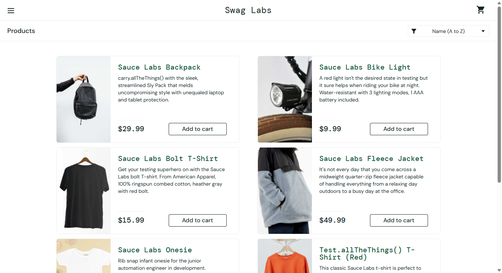

# Repeating Structures

Every online shop has product cards, every dashboard has data rows, every
inbox has message items. They all share the same problem: **N identical
structures, each with different data.**

The classic approach: a method with an index, a loop over all elements,
or a separate locator per instance. It gets messy fast. With
`SetContext` the test simply says: "I am talking about the
*Sauce Labs Backpack* card now."

The theory is in [Basics → SetContext](../../grundlagen/setcontext.md).
This page shows the practice on [saucedemo.com](https://www.saucedemo.com).



## The Test

```robot
*** Keywords ***
Produktpreis Pruefen
    [Arguments]    ${produkt}    ${erwarteter_preis}
    SetContext         ProduktKarte    ${produkt}
    VerifyValue        Produktpreis    ${erwarteter_preis}

Produkt In Warenkorb Legen
    [Arguments]    ${produkt}
    SetContext         ProduktKarte    ${produkt}
    ClickOn            InDenWarenkorb

*** Test Cases ***
SetContext Produktpreise Pruefen
    SauceDemo Oeffnen Und Anmelden

    OnFailNOISE    SelectWindow   SauceDemoProducts
    OnFailNOISE    VerifyValue    Titel    Products
    Produktpreis Pruefen    Sauce Labs Backpack      $29.99
    Produktpreis Pruefen    Sauce Labs Bike Light    $9.99
    Produktpreis Pruefen    Sauce Labs Bolt T-Shirt  $15.99
    Produktpreis Pruefen    Sauce Labs Fleece Jacket  $49.99
    Produktpreis Pruefen    Sauce Labs Onesie        $7.99
    StopApp        MyAppChrome

SetContext Produkt In Warenkorb
    SauceDemo Oeffnen Und Anmelden

    OnFailNOISE    SelectWindow   SauceDemoProducts
    Produkt In Warenkorb Legen    Sauce Labs Backpack
    Produkt In Warenkorb Legen    Sauce Labs Bike Light
    StopApp        MyAppChrome
```

The same keyword (`VerifyValue Produktpreis` — product price), a
different product each time. No loops, no indices, no separate definition
per card. Actions work the same way: the same button name
`InDenWarenkorb` (add to cart) acts on whichever card is currently set.

## One YAML for All Cards

```yaml
# locators/SauceDemoProducts.yaml (excerpt)
ProduktKarte:
  __context__:
    locator: { xpath: '//div[@data-test="inventory-item"][.//div[@data-test="inventory-item-name" and text()="{ProduktName}"]]' }
  Produktname:
    class: okw_web_selenium.widgets.webse_label.WebSe_Label
    locator: { xpath: './/div[@data-test="inventory-item-name"]' }
  Produktbeschreibung:
    class: okw_web_selenium.widgets.webse_label.WebSe_Label
    locator: { xpath: './/div[@data-test="inventory-item-desc"]' }
  Produktpreis:
    class: okw_web_selenium.widgets.webse_label.WebSe_Label
    locator: { xpath: './/div[@data-test="inventory-item-price"]' }
  InDenWarenkorb:
    class: okw_web_selenium.widgets.webse_button.WebSe_Button
    locator: { xpath: './/button' }
```

The `__context__` block defines a container with the **placeholder**
`{ProduktName}`. All child widgets use relative locators (`.//`) — they
are evaluated inside the card that was found.

## How It Works

```
SetContext    ProduktKarte    Sauce Labs Backpack
                  │                    │
                  ▼                    ▼
          context group        placeholder value
```

1. OKW finds `ProduktKarte.__context__.locator`.
2. `{ProduktName}` is replaced with "Sauce Labs Backpack".
3. The resolved XPath is stored as the active context.
4. When `Produktpreis` is accessed, OKW prepends the context XPath to the
   relative child locator.
5. Result: one XPath that finds exactly the price inside the Backpack card.

The next `SetContext` switches to the next card. `SelectWindow` clears
the context.

!!! warning "XPath only"
    SetContext requires XPath — both for the `__context__` locator and
    for the child locators. CSS selectors cannot match text content and
    do not support relative path composition.

## Why Not Just Use XPath With the Product Name?

You could write:

```robot
Click Element    xpath://div[contains(.,'Backpack')]//button[contains(@data-test,'add-to-cart')]
```

But then:

- every test contains the full XPath (NOISE in the test case),
- widget information is lost — no synchronisation, no screenshots,
  no retry,
- every test file must be changed when the DOM changes,
- the locator pattern cannot be reused.

With `SetContext`, the pattern is defined **once** in YAML. The test says
**what it means** — not how to find it.

## Runnable Example

[`selenium/saucedemo/tests/SauceDemo_SetContext.robot`](https://github.com/Hrabovszki1023/okw-examples/blob/master/selenium/saucedemo/tests/SauceDemo_SetContext.robot)
