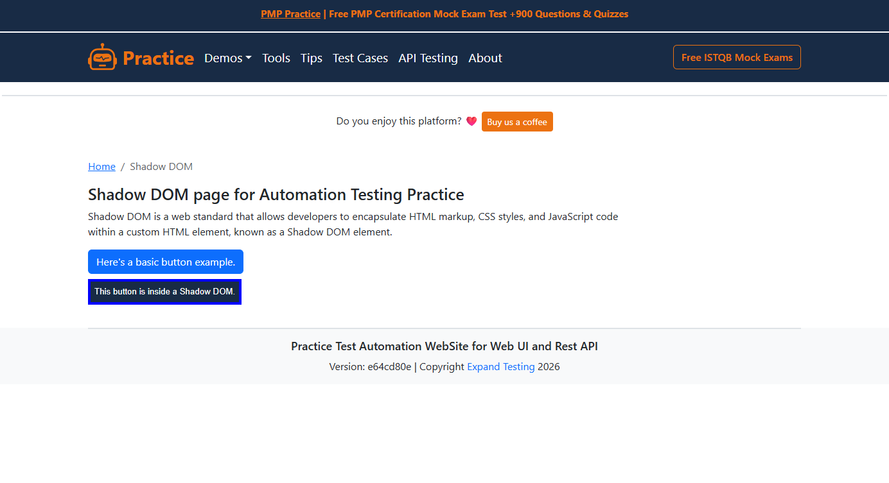
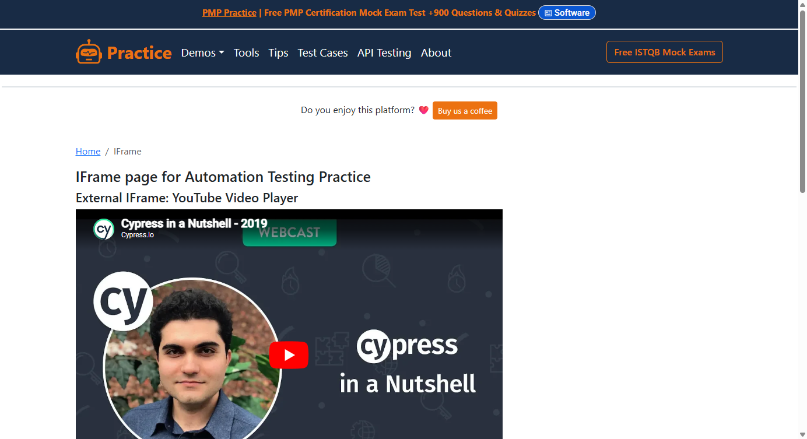

# Shadow DOM und iFrames

Zwei Begriffe, bei denen Selenium-Tester aufstöhnen: **Shadow DOM** und
**iFrames**.

- Elemente im Shadow DOM sind für normale Selektoren unsichtbar.
- iFrames verlangen `switch_to.frame()` und `switch_to.default_content()`
  — verstreut über den ganzen Code.

Beides ist technischer NOISE. **Der Tester sollte davon nichts merken.**
Ein Button ist ein Button — egal ob er im normalen DOM, in einem Shadow
Root oder hinter einem iFrame liegt. Der Benutzer klickt ihn gleich, also
sollte der Test ihn auch gleich ansprechen.

## Shadow DOM



### Der Test

```robot
Normaler Button Hat Text
    VerifyValue    NormalerButton    Here's a basic button example.

Shadow Button Existiert
    VerifyExists    ShadowButton    YES

Shadow Button Hat Text
    VerifyValue    ShadowButton    This button is inside a Shadow DOM.
```

Zwei Buttons, dasselbe Keyword. Der Test weiß nicht, dass einer davon in
einem Shadow Root liegt — beide haben sogar dieselbe `id=my-btn`.

### Die YAML

```yaml
# locators/ShadowDomPage.yaml (Auszug)
NormalerButton:
  class: okw_web_selenium.widgets.webse_button.WebSe_Button
  locator: { id: my-btn }

ShadowButton:
  class: okw_web_selenium.widgets.webse_button.WebSe_Button
  shadow_host: { css: '#shadow-host' }
  locator: { css: '#my-btn' }
```

Eine zusätzliche Zeile: `shadow_host`. OKW navigiert automatisch durch
den Shadow Root (Selenium-4-API `shadow_root`). Verschachtelte Shadow
Roots werden als Liste angegeben:

```yaml
shadow_host:
  - { css: '#outer-host' }
  - { css: '#inner-host' }
```

!!! warning "Nur CSS im Shadow DOM"
    Innerhalb eines Shadow DOM funktionieren nur CSS-Selektoren. Das ist
    keine OKW-Einschränkung, sondern eine Browser-Einschränkung:
    XPath (`document.evaluate()`) akzeptiert keinen Shadow Root als
    Kontext. OKW prüft das und meldet einen klaren Fehler, falls
    versehentlich XPath verwendet wird.

## iFrames



### Der Test

```robot
Email Abonnieren Erfolgreich
    SetValue       EmailEingabe        test@example.com
    ClickOn        AbonnierenButton
    VerifyValue    Erfolgsmeldung      You are now subscribed!

Zwischen Zwei IFrames Wechseln
    VerifyValue       AbonnierenButton    Subscribe
    VerifyValueWCM    EditorBody          *content goes here*
    VerifyValueWCM    IFrameUeberschrift  *inbox*
```

Mehrere iFrames nacheinander — ohne `switch_to.frame()`, ohne
`switch_to.default_content()`. OKW merkt sich den aktiven Frame und
wechselt automatisch.

### Die YAML

```yaml
# locators/IFramePage.yaml (Auszug)
# Hauptseite (kein iFrame)
Seitentitel:
  class: okw_web_selenium.widgets.webse_label.WebSe_Label
  locator: { xpath: '//h1' }

# Im Email-Subscribe-iFrame
EmailEingabe:
  class: okw_web_selenium.widgets.webse_textfield.WebSe_TextField
  iframe: { id: email-subscribe }
  locator: { id: email }

AbonnierenButton:
  class: okw_web_selenium.widgets.webse_button.WebSe_Button
  iframe: { id: email-subscribe }
  locator: { id: btn-subscribe }

# Im TinyMCE-Editor-iFrame
EditorBody:
  class: okw_web_selenium.widgets.webse_label.WebSe_Label
  iframe: { id: mce_0_ifr }
  locator: { id: tinymce }
```

Wieder eine zusätzliche Zeile: `iframe`. Den Rest erledigt der Adapter:

1. Element auf der Hauptseite? → `default_content()` sicherstellen
2. Element in iFrame A? → zu A wechseln und dort bleiben
3. Nächstes Element in iFrame B? → automatisch zu B wechseln
4. Zurück zur Hauptseite? → zu `default_content()` wechseln

**Regeln:**

- `iframe` akzeptiert dieselben Locator-Strategien wie `locator`
  (css, xpath, id, ...). Anders als beim Shadow DOM gibt es keine
  Einschränkung auf CSS.
- Verschachtelte iFrames (Frame im Frame) werden nicht unterstützt.
- Nutzen zwei Widgets nacheinander denselben iFrame, wird nur einmal
  gewechselt.

## Das Muster

| Feature | YAML-Key | Änderung im Testcode | Selektoren |
|---|---|---|---|
| Shadow DOM | `shadow_host: { css: '...' }` | Keine | Nur CSS |
| iFrame | `iframe: { id: '...' }` | Keine | CSS + XPath |

Die Information über die Isolationsgrenze steht in YAML. Der Test bleibt
sauber. Der Adapter wechselt transparent.

Das bedeutet treiberunabhängig: **Technische Details gehören in die
Locator-Definition, nicht in die Testlogik.**

## Lauffähige Beispiele

| Beispiel | Datei |
|---|---|
| Shadow DOM | [`selenium/expandtesting/tests/ShadowDom.robot`](https://github.com/Hrabovszki1023/okw-examples/blob/master/selenium/expandtesting/tests/ShadowDom.robot) |
| iFrames | [`selenium/expandtesting/tests/IFrame.robot`](https://github.com/Hrabovszki1023/okw-examples/blob/master/selenium/expandtesting/tests/IFrame.robot) |
