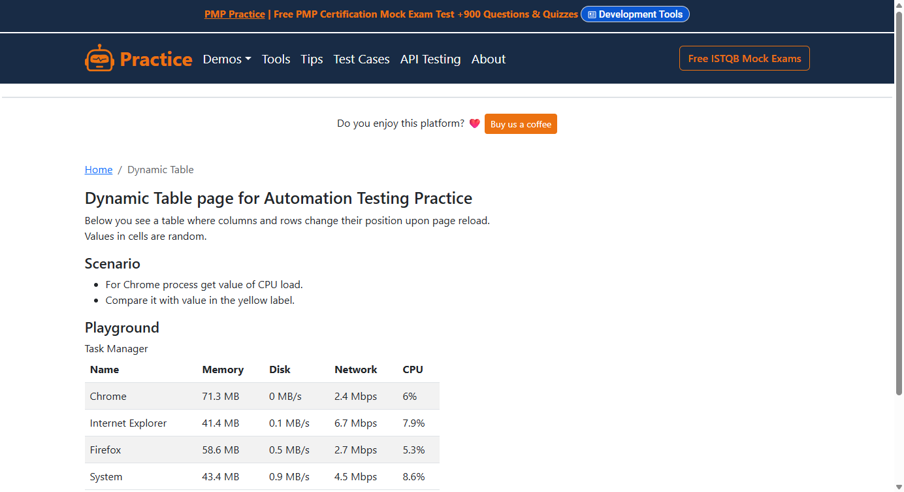

# Tables

The table on the demo page shuffles its rows and columns on every page
load. Chrome is in row 3 today and in row 1 tomorrow. CPU is sometimes
column 4, sometimes column 2.

Most Selenium solutions address cells by position: `table/tr[3]/td[4]`.
That breaks the moment the order changes. So you write helper methods
that read headers, search rows by name and cross-reference columns —
many lines of code for one value.



## The OKW Solution

```robot
Dynamische Tabelle Chrome CPU Pruefen
    OnFailNOISE    StartApp       MyAppChrome

    OnFailNOISE    SelectWindow   Chrome
    OnFailNOISE    SetValue       URL    ${URL}

    OnFailNOISE    SelectWindow   DynamicTablePage
    MemorizeTableCellValueByHeaders    TaskManager    Chrome    CPU    CHROME_CPU
    VerifyValueWCM     ChromeCpuLabel    *${CHROME_CPU}*
    StopApp        MyAppChrome
```

One keyword: table name, row key, column header, variable name. OKW finds
the cell wherever Chrome and CPU currently are.

`MemorizeTableCellValueByHeaders`:

1. finds the table widget `TaskManager`,
2. reads the header row and determines the index of column `CPU`,
3. searches the key column (default: first column) for the row
   `Chrome` — the row key is a wildcard pattern,
4. reads the value at the intersection,
5. stores it in `${CHROME_CPU}`.

If no row key or more than one row key matches, the keyword fails with a
clear message.

## The YAML

```yaml
# locators/DynamicTablePage.yaml (excerpt)
TaskManager:
  class: okw_web_selenium.widgets.webse_table.WebSe_Table
  locator: { css: 'table' }

ChromeCpuLabel:
  class: okw_web_selenium.widgets.webse_label.WebSe_Label
  locator: { css: '.bg-warning' }
```

The table is **one** widget. No column definitions, no row templates.
`WebSe_Table` reads the HTML structure (`<thead>`, `<tr>`, `<td>`) and
builds the mapping at runtime.

## Why Headers Instead of Positions?

Dynamic tables are everywhere:

- Task managers (processes reorder by CPU/memory)
- Dashboards (columns configurable by the user)
- Search results (sort order changes)
- Admin panels (data changes between tests)

Position-based selectors (`tr[3]/td[4]`) are brittle by design.
Header-based lookup is **semantically stable**: it finds "Chrome's CPU
value" regardless of layout. That is Signal instead of NOISE.

## Table Keywords at a Glance

| By header (business) | By position | Purpose |
|---|---|---|
| `VerifyTableCellValueByHeaders` | `VerifyTableCellValue` | Verify cell value (also `…REGX`) |
| `MemorizeTableCellValueByHeaders` | `MemorizeTableCellValue` | Store cell value in a variable |
| `LogTableCellValueByHeaders` | `LogTableCellValue` | Write cell value to the log |
| `SetTableCellValueByHeaders` | `SetTableCellValue` | Enter a value into a cell |
| `ClickOnTableCellByHeaders` | `ClickOnTableCell` | Click a cell |
| `DoubleClickOnTableCellByHeaders` | `DoubleClickOnTableCell` | Double-click a cell |
| `VerifyTableRowContentByHeader` | `VerifyTableRowContent` | Verify a whole row |
| `VerifyTableColumnContentByHeader` | `VerifyTableColumnContent` | Verify a whole column |
| – | `VerifyTableRowCount`, `VerifyTableColumnCount` | Verify counts |
| – | `VerifyTableHasRow`, `VerifyTableContent` | Row exists / full content |

**Recommendation:** Use the `ByHeaders` variants wherever possible. Use
positions only when the table has no headers.

All table keywords log screenshots on three levels:
**cell → row → whole table**. The Robot log shows, from detail to
overview, which cell was checked.

## Runnable Example

[`selenium/expandtesting/tests/DynamicTable.robot`](https://github.com/Hrabovszki1023/okw-examples/blob/master/selenium/expandtesting/tests/DynamicTable.robot)
